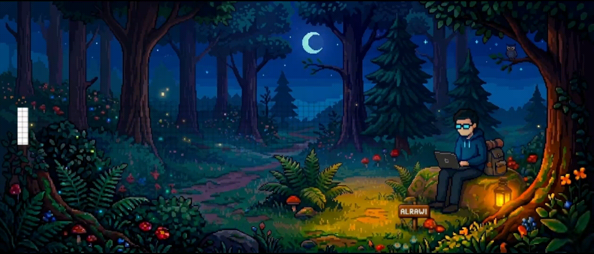

<!-- Premium Minimal Banner -->

  

<h2 align="center">Full-Stack Web Developer • AI Engineer • Creative Designer</h2>

  I build scalable web applications, intelligent AI systems, and modern user experiences.

---

## 🧠 About Me

- 🚀 Building modern **Web Apps & AI Solutions**
- 🧩 Strong focus on clean architecture & performance
- 🎨 Passionate about UI/UX and visual clarity
- 📈 Goal: Professional Full-Stack & AI Engineer
- ⚡ Always learning. Always improving.

---

## 🛠 Core Technologies

### 💻 Web Development

### 🤖 AI & Programming

### 🗄 Databases & Tools

---

## 🌍 Professional Links

  
  
  

